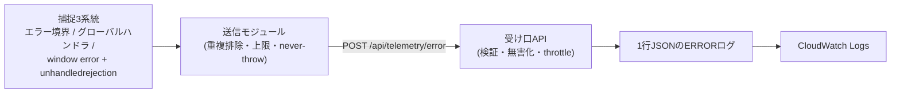

## はじめに

正直に書きます。私たちのサービス（fixU）の品質には、まだまだ改善の余地があります。フロントエンドの不具合でお客様にご不便をおかけする場面があり、申し訳なく思うと同時に、しっかり改善に取り組んでいきたいと考えています。

この記事は、その取り組みの一つとして導入した「**LINEミニアプリ（LIFF）のフロントで起きた描画クラッシュを、お客様からの問い合わせより先に開発側が知る**」仕組みの話です。外部のエラートラッキングSaaSを使わず、CloudWatch Logs への集約に帰着した判断と、AI（Claude Code / モデルは Claude Fable）がベース設計を作り、人間（シニアエンジニア）との質疑応答で仕上げた開発プロセスの両面を書きます。

想定読者は、LIFF や SPA のフロント運用に携わるエンジニアと、AIエージェントとの協働開発を実践・検討している方です。

---

## 1. LIFFのフロントは、サーバーより一段観測しにくい

サーバーサイドは自分の土俵です。ログは手元にあり、スタックトレースが残り、メトリクスやアラートの仕組みも成熟しています。ところがフロントの JavaScript は**ユーザーのブラウザの中で死ぬ**ため、何も配管を作らなければ、開発側には文字どおり何も残りません。

LIFF（LINE Front-end Framework）になると、これに固有の厄介さが重なります。

- **LINEアプリ内の WebView で動く**ため、環境が「端末 × OS × LINEアプリのバージョン」の掛け算になり、再現も特定も難しい
- PCブラウザのように開発者ツールを開いてもらうわけにいかず、**デバッグの導線が細い**。ユーザーから届く情報は良くてスクリーンショット1枚
- そもそも LINE のミニアプリを使う場面は「その場でサッと使いたい」文脈が多く、**うまく動かなければ問い合わせより先に静かに離脱**されがち

さらに SPA（今回は Vue）には普遍的な落とし穴があります。データ取得を非同期のライフサイクルフックに置くと、**フレームワークはその完了を待たずに初回描画を走らせる**ため、「まだ undefined のデータをテンプレートが参照して描画クラッシュ」という競合が構造的に起きえます。

```js
// 説明のための簡略・架空コードです
const itemData = ref()               // 初期値は undefined
onBeforeMount(async () => {
  itemData.value = await fetchItem() // 描画はこの完了を待たない
})
// テンプレート側: {{ itemData.name }} → 初回描画で TypeError
```

そして今回いちばん痛感したのが、**ガード層の皮肉**です。白画面対策としてエラー境界（Vue の `onErrorCaptured` でクラッシュを捕捉してフォールバックUIを出す層）を入れると、ユーザー体験は確かに守られます。ところがエラーを堰き止めるということは、フレームワークが持っていた「リアクティブな再描画で自然に復帰する」動きも堰き止めるということでもあり、捕捉後の挙動設計を誤ると**「白画面」が「静かなエラーカード固着」に化ける**ことがあります。守りを固めるほど、失敗はユーザーの画面の中だけで完結し、開発側からはますます見えなくなる——観測の配管がなければ、ガード層は失敗を沈黙させる方向に働くのです。

> **学び**: フロントの失敗は「見えない」のではなく、「開発側に届く経路が存在しない」。届ける配管を作らない限り、ガードを固めるほど失敗は静かになる。

---

## 2. 入れた仕組み — クラッシュを CloudWatch Logs に集約する

導入した仕組みの全体像はシンプルです。



クラッシュが起きると、既存の捕捉点（エラー境界・フレームワークのエラーハンドラ・window のエラーイベント）から送信モジュールが呼ばれ、バックエンドの受け口に POST します。受け口は検証・無害化したうえで、**マーカー付きの1行JSON**としてアプリログに書きます。コンテナの標準エラー出力は CloudWatch Logs に流れる構成なので、これだけで集約が完成します。

```
production.ERROR: [MYAPP_LIFF_CRASH] {"source":"error-boundary","page":"Item/Detail","name":"TypeError","message":"Cannot read properties of undefined ...","store_id":123,...}
```

（マーカー名・ページ名は説明用の架空のものです）

行頭のマーカーが検索キーになり、「いつ・どの画面で・何が・どの店舗の利用中に」が1行で分かります。問い合わせが来たときの調査は「時刻とマーカーで検索」の数十秒に短縮され、後述のメトリクスフィルタ→アラート化への布石にもなります。

機能そのものより、設計として大事にした**不変条件**を並べます。

| 不変条件 | 内容 |
|---|---|
| レポーターは絶対に自分がクラッシュしない | 送信は投げっぱなし（fire-and-forget）で失敗は握りつぶす。**リトライもしない**（サーバー障害時の負荷増幅と無限ループの火種になるため）。「報告失敗 → それ自体がエラー → また報告」の再帰をテストで仕様として固定 |
| 送信量は必ず有界 | 同一エラーはページ表示ごとに1回（重複排除）、総送信数にも上限。クラッシュが暴走ループしても洪水にならない |
| 受け口は疑ってかかる | 認証なしで受ける以上、流量制限・サイズ上限・許可リスト検証・**制御文字の除去（ログ行偽造の防止）**をサーバー側でも重ねる |
| 個人情報は送らない | 氏名・連絡先・トークン類は最初から payload に含めない。追跡は内部の数値IDで足りる |
| 応答は常に成功で返す | 報告の失敗がクライアント側で二次クラッシュを誘発しない |

もう一つ、後から効いてくるのが**パスの名前空間設計**です。当初 AI は `/api/front-error-log` のようなフラットなパスを切りましたが、最終的に `/api/telemetry/error` という**名前空間の下**に置き直しました。将来、計測系のエンドポイント（性能タイミング等）が増えたとき、ロードバランサのパスルール1本（`/api/telemetry/*`）でテレメトリ系だけを別バックエンドに切り出せるからです。この補正が入った経緯は第4章で書きます。

> **学び**: クラッシュレポーターの第一要件は機能ではなく「無害であること」。観測の仕組みが本体の障害源になったら本末転倒。

---

## 3. なぜ外部SaaSではなく CloudWatch Logs か

フロントのエラートラッキングといえば Sentry に代表される外部SaaSが定番で、実際に検討もしました。それでも自前の受け口 + CloudWatch Logs に帰着したのは、次の3つの判断基準からです。

**1. エラーデータの「持ち出し審査」が先に立つ**
スタックトレース・URL・ユーザー識別子を含むエラーデータを社外のサービスへ送ることは、技術選定の前にセキュリティ規程・情報管理の審査事項になります。守りたいもの（お客様のデータ）を考えると、ここのハードルは高くあるべきで、「まず社内に閉じて始める」が素直でした。

**2. チームが毎日見ている場所に出す**
うちのチームはサーバーログの調査・監視を既に CloudWatch Logs 中心で回しています。可観測性は「見られなければゼロ」なので、**新しいダッシュボードを増やすより、毎日見ている場所に流す**方が運用に乗ります。既存のログ検索の手癖（ERROR で絞る等）にそのまま引っかかるよう、ログレベルも ERROR に揃えました。

**3. 追加インフラゼロで今日始められる**
AWS 純正の CloudWatch RUM も検討しましたが、認証まわりのリソース新設などインフラ変更が必要になります。自前受け口 + 既存ログ経路なら**アプリのデプロイだけで完結**し、コストもクラッシュがレアイベントである限り月数円〜数十円のオーダーです。

割り切った点も明確にしています。エラーのグルーピング、ソースマップによる可読化、リリースへの自動紐付けといった領域は Sentry 系の圧勝です。ただ、今回の目的は「**問い合わせより先に気づき、調査を即時化する**」であり、そこには過剰でした。また、性能計測（Web Vitals など全ページビューで発生する統計型データ）は1件1行のログとは量の桁が違うため、**最初から別経路（サンプリング + メトリクス化）として設計だけ切り分け**てあります。

> **学び**: 「最強のツール」より「チームが毎日見る場所」。小さく始めるなら、既存のログ基盤への相乗りは有力な選択肢になる。

---

## 4. AI がベースを設計し、人間の問いが仕上げた

この仕組み、実装したのは AI です。コードベースと過去事例の調査、業界プラクティスの棚卸し、設計書、テストファーストの実装、プルリクエスト作成、AIレビュー（Copilot）対応まで、AIエージェントが自走しました。

ただし、そのまま出荷はしていません。ベース設計が出そろった時点で、人間（シニアエンジニア）が**質疑応答だけで設計をブラッシュアップする時間**を取りました。投げた問いはおよそ12問。型としてはこうです。

- 概要を一言で / 導入前と後で何が変わる
- 送るのはエラーだけか、**拡張性**は
- この実装は**最適**か、代替案は何で、なぜ捨てた
- フロント側への**副作用**は（遅延・リソース・サーバーダウン時）
- **セキュリティリスク**は
- ログの**保持期間・容量・料金**、個人情報の削除制約との関係
- ロググループ等の**設定はどのリポジトリが持つべき**か（所有権の分界）

AI の回答はおおむね適切でしたが、**人間の問いで実際に補正が入った点が3つ**あります。

**補正1: パスの名前空間化。** AI が切った `/api/front-error-log` に対し、「エンドポイントが増えてバックエンドを描画系とロギング系に分けたくなったとき、**ロードバランサのパスルールで表現できない**」の一言で `/api/telemetry/` 名前空間へ設計し直しました。AI の実装は制約の中では正しかったのですが、インフラが将来どう進化するかの絵は、運用してきた人間の側にありました。

**補正2: 追跡性の実務要求。** 「クラッシュしたのがどの店舗・どの利用者かを、カスタマーサポートがスムーズに辿れるか？」という問いに対し、AI の初期実装は識別子の取得元が狭く、画面によっては店舗を特定できないケースがありました。個人情報の最小化に忠実だった AI に、**実務の導線（CS が誰に何を案内するか）**という要求軸を足して、内部IDの補完を強化しました。

**補正3: 意思決定の明確化。** AI が説明の中で「将来必要になれば外部サービスの再評価も」と保険をかけたのに対し、「**移行する可能性が高いならこの方法は採用できない**」と突っ込みが入りました。整理した結果、「外部SaaSの導入構想はない。CloudWatch Logs を恒久採用する。再評価条項は別種の需要（本格的な性能計測）が生まれた場合の話」と意思決定を明文化。曖昧な保険表現は、チームの意思決定を濁すノイズになる——これは AI の技術力ではなく、**組織としての判断の言語化**の問題でした。

ちなみに AI 側にも、設計着手前に業界ベストプラクティス・暗黙前提・失敗シナリオ・複数の代替案を自己開示させるプロトコルを義務付けています（このあたりは過去記事 [AIは知っているのに使わない — 設計タスクの "task-kickoff" プロトコル](https://zenn.dev/fixu/articles/task-kickoff-ai-design-protocol) に書きました）。それでも今回の3点は、プロトコルだけでは出てこなかった。**AI は与えられた制約の中での最適化が得意で、人間の価値は制約そのものを動かす問い——インフラの将来像、実務の導線、意思決定の明確さ——にある**、というのが現時点の実感です。

> **学び**: AIのベース設計に対する人間レビューは、コードの行を読むより「問い」を重ねる方が効く。問いの型（拡張性・副作用・セキュリティ・コスト・所有権・代替案）は使い回せる。

---

## まとめ — AIネイティブ開発をもっと加速するために

今回の取り組みを一段引いて見ると、こういう分業でした。

| フェーズ | 主担当 | 人間の関与 |
|---|---|---|
| 調査・設計・実装・テスト・PR | AI | 挙動の監視と最終判断 |
| ベース設計のレビュー | 人間 | **深く入り込む**（12問の質疑応答） |
| 日々の検知・調査（これから） | AI | 関与度を下げていく |

重要なベース設計には人間がしっかり入り込む。一方で日々の改善は人間の関与度を下げ、AI が回せるようにする。そのために不可欠なのが今回のような**観測の足場**です。クラッシュが構造化されてログに残るようになれば、次のステップは「AI が自らログを監視し、異常を検知し、原因調査から修正PRまで導く」ところまで見えてきます。

品質改善は道半ばです。お客様にご迷惑をおかけしない状態へ近づけるために、そして AI ネイティブな開発体制をもう一段加速するために、こうした足場づくりを日々続けていきます。

---

### 関連記事

- [AIは知っているのに使わない — 設計タスクの "task-kickoff" プロトコルで潜在能力を引き出す](https://zenn.dev/fixu/articles/task-kickoff-ai-design-protocol)
- [「推測」から「計測」へ ― AIネイティブ時代における意思決定スタンスのアンラーニング](https://zenn.dev/fixu/articles/measure-dont-guess-ai-native)
- [Copilotの指摘に5往復従わせたらAIのスコープが逸脱した話](https://zenn.dev/fixu/articles/copilot-review-scope-creep-revert)
