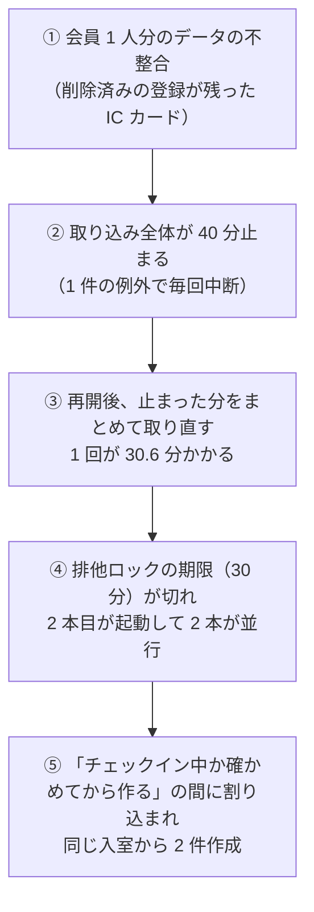

## はじめに

私たちはこれまで、スピードとコストを優先して AI ネイティブ開発を進めてきました。チケットごとに AI のセッションが設計・実装・検証を担い、統括役の AI がそれらを束ね、人は判断と承認に集中する。この形で、少人数のチームでも開発の速度は大きく上がりました。

いまは品質に重きを置き、日々改善を積み重ねています。理想は「無事故で運営できる枠組み」です。ただ、正直に書くと、まだその道半ばにあります。

先日、本番で小さな事故を起こしました。金銭的な影響はなく、影響を受けた会員さまは数名で、翌朝までに片付けと恒久対応を終えています。規模だけ見れば、社内の報告で閉じてもよい事故でした。

それでも記事にするのは、この事故が **AI ネイティブ開発の現在地をよく映している** と感じたからです。原因をたどると、関わった変更はどれも、それ単体では正しいものでした。レビューも検証も通っていました。事故は、差分の外で起きていました。

核を先に書きます。

> **AI で速くなった開発は、差分の中を正しくすることには強い。事故は差分の外、つまり変更と変更、変更と既存の設定の「組み合わせ」で起きる。無事故の枠組みとは、その組み合わせを AI が毎回機械的に確かめられる形に落とすことだ。**

想定読者は、AI エージェントで開発を加速させてきて、そろそろ「速さの裏で何を踏み抜いているか」を仕組みで押さえたいと考えているチームの方です。

---

## 1. 何が起きたか

私たちのサービスでは、外部のスマートロックサービスから入退室の記録を定期的に取り込み、会員さまのチェックイン（利用の開始）を自動で作っています。取り込みは数分おきに起動する定時処理で、同時に 2 本走らないようにロックで排他しています。

ある日の午後、この取り込みが一時的に 2 本同時に走りました。2 本がほぼ同じ瞬間に同じ入室記録を処理し、両方がチェックインを作ったため、1 回の入室から利用の記録が 2 件ずつできてしまいました。

- 影響: 数名の会員さまで、利用履歴が二重に表示される状態が翌朝まで続きました
- 金銭: 影響なし。二重にできた側は、既存の保護機能によって課金されずに締められていました
- 検知: 前日のリリースで「二重チェックイン」を戻し条件の一つとして観測項目に入れており、リリース後の巡回で見つけました
- 対応: 翌日未明に重複分を取り消し、同じ日の朝に恒久対応を本番に反映しました

---

## 2. 事故の連鎖

原因は 1 つではありません。5 つの出来事が、ドミノのように順に倒れていました。

一つずつ見ると、それぞれに理由がありました。

- ロックの期限 30 分は、3 か月近く前に実測した所要時間（最大 12 分）をもとに決めた、当時としては十分な値でした
- 「止まった分を最大 60 分さかのぼって取り直す」仕組みは、事故の前日のリリースで入れたものです。取り込み漏れをなくすための正しい改善で、実際に 1 回の平均所要時間は約 11 分から約 6 分に縮みました
- 「チェックイン中か確かめてから作る」処理は、同時に 1 本しか走らない前提なら正しく動きます

どれも、それ単体では正しい。事故は、それらの **組み合わせ** で起きました。象徴的なのは前日の改善で、**平均は速くなったのに、最悪のケースは長くなっていた** のです。平均の改善は観測で確かめましたが、最悪のケースが既存のロック期限とぶつかるかどうかを確かめる手順は、まだありませんでした。

---

## 3. なぜ AI にも人にも見えなかったのか — 5 つの理由

「どうすれば防げたか」を考えると、今回の修正そのもの（ロック期限の延長など）より一段上に、仕組みの穴が 5 つ見えてきました。

### 理由 1: 実測で決めた数値は古くなる

ロックの期限は実測をもとに決め、コードのコメントにも「実測上限 12 分」と書いてありました。ところが取り込み対象が増えるにつれて所要時間は伸び、2 か月後には約 16 分（期限の 55%）、事故の直前には最大約 20 分（66%）になっていました。

数値が決まった瞬間には正しくても、前提は時間とともに腐ります。そして **前提が崩れたことを知らせる仕組みは、まだ用意できていませんでした**。

### 理由 2: 「一度しか作らない」をロックだけで守っていた

利用の記録を作る処理は「同時に 1 本しか走らない」ことを前提にしていて、同じ入力で二度走っても 1 件しか作らない作り（冪等性）にはなっていませんでした。

ロックは、期限切れやプロセスの異常終了で壊れることがあります。今回使っていたフレームワークのロックは、前の回が終わるときに持ち主を確かめずに解放する実装でもありました。お金や利用に関わる記録を、**壊れうる仕組み 1 つだけで守っていた** ことになります。

### 理由 3: 変更の影響を、差分の中だけで見ていた

前日の改善は、「1 回の所要時間」という実行時の性質を変える変更でした。本来なら、時間に依存する周りの設定（ロック期限・起動間隔・タイムアウト）と突き合わせるべきものです。

しかし設計でも、AI によるコードレビューでも、人のレビューでも、その突き合わせは行われませんでした。レビューは差分に集中します。差分に出てこないロック期限は、AI にも人にも見えませんでした。

加えて、AI ネイティブ開発に特有の構造もありました。私たちはチケットごとに AI のセッションを立て、そのチケットの範囲で設計から検証までを完結させます。ロック期限を決めたのは 3 か月近く前の別のチケット、取り直しを入れたのは前日のチケット、全体を止めた不具合はさらに別の場所です。**チケットをまたぐ相互作用は、どのセッションの担当範囲にも入っていませんでした**。

### 理由 4: 異常から回復するときの動きを試していなかった

平常時の取り込みは 6〜12 分ほどで、テストも平常の形で行っていました。いちばん長く重くなるのは「止まった後にまとめて取り直す」回ですが、そこは試していません。

さらに、検証環境では外部サービスの応答を模擬に差し替えています。模擬は一瞬で応答を返すので、**時間に関わる問題は検証環境では構造的に見えません**。テストが通ることと、本番の最悪ケースで安全なことは、別の話でした。

### 理由 5: 1 件の異常で全体が止まる作りだった

きっかけは、会員さま 1 人分のデータの不整合でした。削除済みの登録が残った IC カードでの入室 1 回で、全スペース分の取り込みが 40 分止まりました。

この停止が長い取り直しを生み、理由 2 の弱点を突きました。局所の異常が、全体の事故に連鎖したのです。

---

## 4. 恒久対応ではなく、枠組みを直す

今回の修正（ロック期限の延長、外部 API の時間制限、会員単位のロック、取り込みが止まったら鳴るアラーム）は、事故の翌朝に本番へ反映しました。ただ、それは「今回の穴」を塞いだだけです。次に別の場所で同じ形の事故を起こさないために、5 つの理由それぞれに対応する枠組みの見直しを決めました。

### 1. 設計書に「実行時の性質の変化」欄を必須にする

所要時間・実行頻度・同時に走る本数・回復時の最大量のどれかが変わるかを書きます。変わる場合は、依存する時間系の設定（ロック期限・タイムアウト・起動間隔・キャッシュの寿命）を列挙して突き合わせます。統括役の AI は、レビューでこの欄を確認します。

今回なら、前日の改善の設計の時点で「回復時の最大所要時間とロック期限 30 分」という一行が表に出ていたはずです。**差分の外にあるものを、設計書の中に引き込む** のが狙いです。

### 2. 失敗系チェックリストを、決済以外にも広げる

これまで決済の変更に限って、着手前に失敗系のチェックリストを当ててきました。その対象を、会員の利用・売上・通知の記録を作る処理全般（定時処理・外部サービスとの同期・外部からの通知の受け口を含む）に広げます。

- 2 回目に走ったら
- 2 本同時に走ったら
- 途中で落ちたら
- 遅れて届いたら
- 止まった後の回復時に、最大どれだけ処理するか

### 3. 記録を作る処理には、冪等性のテストを必須にする

同じ入力を 2 回流す、2 本同時に流す。その両方で記録が 1 件だけ作られることを確かめます。時間が関わる変更では、回復時の最大所要時間を本番のログから見積もり、設計書に書きます。模擬の環境では測れないからです。

### 4. 閾値を持つ設定には、「前提の監視」を対で付ける

ロック期限・タイムアウト・起動間隔のように実測から決めた数値には、実測がその 50% を超えたら警告を出す監視を対で付けます。今回なら、所要時間が 16 分を超えた時点、つまり事故の 3 週間前に気づけていました。

もう一つ、業務上「起きてはいけない状態」（1 回の入室でチェックイン 1 件、1 回の予約で課金 1 回など）は、リリース時の観測項目に入れます。一度でも違反が出たら、常設の監視にするかを判断します。

### 5. 1 件の異常で全体を止めない

定時処理や同期では、1 件ずつ失敗を数えて処理を続けることを実装の基準にします。

---

## 5. うまく働いたこと

事故を起こした一方で、被害を小さく抑えられた理由もはっきりしていました。これらは続けます。

- **戻し条件を先に書いていた。** 前日のリリースで、観測項目の戻し条件に「二重チェックイン」を入れていました。だからリリース後の巡回で、会員さまからのご連絡より先に見つけられました。何が起きたら戻すかを、起きる前に書いておく価値を改めて感じました
- **多層の防御が効いた。** 課金の段階に、二重にできた記録へ課金しない保護が別に入っていました。取り込みの層が破れても、お金の層で止まりました
- **片付けを手順どおりに行った。** 重複の取り消しは本番データの更新です。退避を取り、検証環境で同じ形のデータを作って予行し、切り戻しの手順まで確かめてから実行しました

---

## 6. AI が機械的に当てられる形にする

4 章の見直しは、どれも目新しいものではありません。経験のあるエンジニアなら「当たり前」と感じる項目ばかりだと思います。

問題は、当たり前のことを毎回やり切るコストでした。人が変更のたびにロック期限やタイムアウトを洗い出し、失敗系を 5 項目当て、冪等性のテストを書くのは、スピードを優先してきた私たちにとって重い作業です。だから、どこかで省かれていました。

AI ネイティブ開発では、この構図が変わります。**厳密なチェックは、人がやると高くつきますが、AI なら毎回ほぼタダで当てられます**。そのためには、チェックを「はい／いいえで答えられる形」で書き、開発ワークフローの決まった位置（設計書のテンプレート、着手前のチェック、統括のレビュー観点）に埋め込んでおく必要があります。「気をつける」では AI は動けません。「この欄を埋める」「この 5 問に答える」なら動けます。

スピードと無事故を両立する鍵は、ここにあると考えています。速さを落として慎重になるのではなく、慎重さを機械的に当てられる形に変えて、速さの中に組み込む。以前 [機能は速く、安全装置は勝手に付かない — AI 開発元の減速宣言と私たちのペース配分](https://zenn.dev/fixu/articles/features-fast-safeguards-dont-follow-pace) で、余った開発力を土台の強化に充てると書きました。今回の見直しは、その土台に「確かめ方」を加えるものです。

---

## 7. 現在地の告白

最後に、いまどこまでできているかを正直に書いておきます。

- **できた:** 今回の穴（ロック期限・時間制限・会員単位のロック・止まったら鳴るアラーム）は塞ぎました。1 件の異常で全体を止めない作りへの修正も、事故の当夜に反映しました
- **これから:** 4 章の 5 つの見直しは、開発ワークフローの文書と、各 AI セッションが読むチェックリストへの反映を進めているところです。まだ、すべての変更に当たっているわけではありません
- **残っている債務:** 会員単位のロックは、取り込みが 1 つのコンテナで動いている前提で効きます。将来、処理を複数に分ければ効かなくなります。根本的には、データベースの側で「同じ入室記録から利用を 2 件作れない」制約が必要で、これはまだ入っていません

一定の割合の事故は、スピードを優先してきた代償として受け止めています。そのうえで、同じ形の事故は二度起こさない。起きた事故を、次の変更のたびに AI が確かめる一行に変えていく。無事故の枠組みは、その積み重ねでしか作れないのだと思います。

---

## まとめ

- 外部サービスからの取り込みが一時的に 2 本並行し、1 回の入室から利用の記録が 2 件作られました。金銭的な影響はなく、翌朝までに片付けと恒久対応を終えました
- 関わった変更は、どれも単体では正しいものでした。事故は、変更と既存の設定の組み合わせという「差分の外」で起きました。前日の改善は平均を速くし、最悪のケースを長くしていました
- 防げなかった理由は 5 つです。実測で決めた数値の腐敗、ロックだけに頼った一回性、差分の中だけの影響評価、回復経路の未検証、1 件の異常で全体が止まる作り
- 対応として、設計書の「実行時の性質の変化」欄、失敗系チェックリストの適用範囲の拡大、冪等性テストの必須化、前提の監視（50% ルール）、1 件単位の失敗の隔離を決めました
- 当たり前のチェックを人が毎回やるのは高くつきますが、AI なら毎回当てられます。はい／いいえで答えられる形でワークフローに埋め込むことが、スピードと無事故を両立させる鍵だと考えています。私たちはまだ、その道半ばにいます

---

## 参考

- [機能は速く、安全装置は勝手に付かない — AI 開発元の減速宣言と私たちのペース配分](https://zenn.dev/fixu/articles/features-fast-safeguards-dont-follow-pace)
- [AIネイティブ開発ワークフロー3.0を設計して、今はやらないと決めた話](https://zenn.dev/fixu/articles/ai-native-workflow-3-0-designed-and-deferred)
